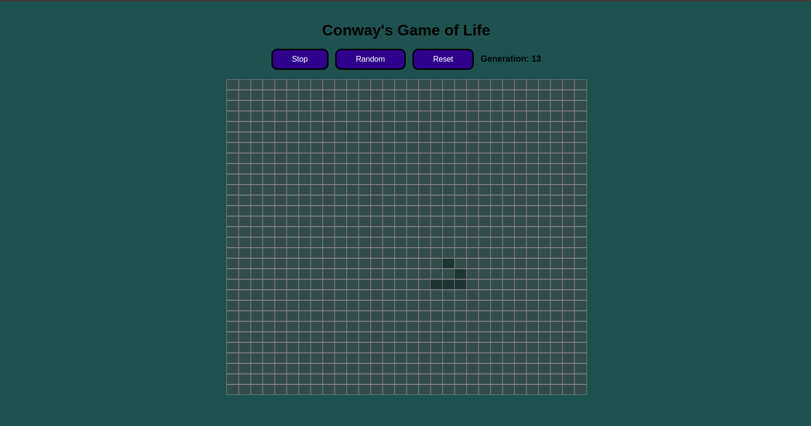

# Conway's Game of Life

This project is an implementation of Conway's Game of Life using plain HTML, CSS, and JavaScript. It was developed as an assignment for ROC8-Moonshot.

## Introduction

Conway's Game of Life is a cellular automaton devised by the British mathematician John Horton Conway in 1970. It consists of a grid of cells that evolve through a series of generations based on a set of simple rules. Each cell can be either alive or dead, and the state of each cell in the next generation is determined by its eight neighbors.

## Rules

1. Any live cell with fewer than two live neighbors dies (underpopulation).
2. Any live cell with two or three live neighbors lives on to the next generation.
3. Any live cell with more than three live neighbors dies (overpopulation).
4. Any dead cell with exactly three live neighbors becomes a live cell (reproduction).

## Features

- **Grid Size:** The grid is fixed at 30x30 cells.
- **Default Grid:** A predefined pattern of live cells (glider) is initialized to ensure continuous activity.
- **Random Grid:** Generates a grid with random live cells.
- **Interactive Grid:** Click on cells to toggle their state (alive or dead).
- **Start/Stop Button:** Starts or stops the evolution of the grid.
- **Reset Button:** Resets the grid to the default pattern.
- **Generation Counter:** Displays the number of generations that have passed.

## Usage

1. **Open the Project:**
   - Open `index.html` in your preferred web browser.

2. **Default Grid:**
   - The grid starts with a predefined pattern of live cells.

3. **Start/Stop the Game:**
   - Click the "Start" button to begin the evolution of the grid. Click the "Stop" button to pause the game.

4. **Random Grid:**
   - Click the "Random" button to generate a grid with random live cells.

5. **Reset Grid:**
   - Click the "Reset" button to reset the grid to the default pattern.

6. **Interactive Grid:**
   - Click on individual cells to toggle their state (alive or dead).

## Files

- `index.html` - The main HTML file containing the structure of the game.
- `style.css` - The CSS file containing the styling for the game.
- `script.js` - The JavaScript file containing the logic for the game.

## Author

Developed by Anchal Raj for the ROC8-Moonshot assignment.

---

### How to Run

1. Clone the repository or download the project files.
2. Open `index.html` in your preferred web browser.
